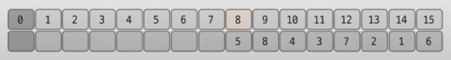
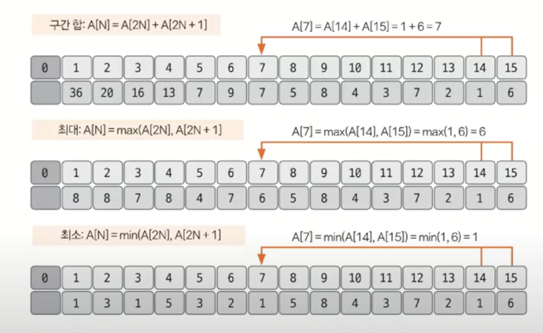
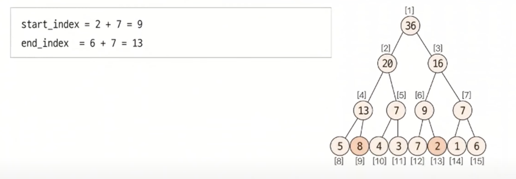
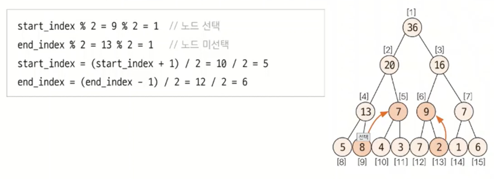
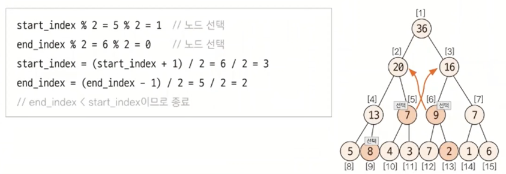
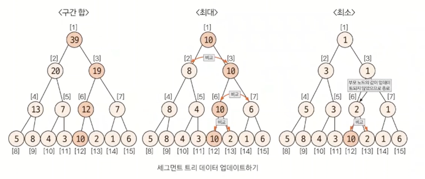

[참고 영상](https://www.youtube.com/watch?v=1d9sqmuLy-o&ab_channel=%ED%95%98%EB%A3%A8%EC%BD%94%EB%94%A9)

## 세그먼트 트리
* `인덱스 트리`라고도 불림
* `구간 합`과 `데이터 업데이트`를 빠르게 수행하기 위해 고안해낸 자료구조 형태

* 구간 합은 누적 합 배열로도 구할 수 있는데 세그먼트 트리가 왜 필요한가? 
  * 배열에서는 데이터 업데이트가 굉장히 느림 
  * 데이터의 업데이트가 빈번하게 일어나면 성능이 좋지 않음

* 세그먼트 트리 종류
  * 구간 합, 구간 곱 최대, 최소 구하기 등으로 다양하게 나눌 수 있음
  * 각각 종류의 트리에서 데이터를 업데이트하는 방법만 약간 다를 뿐 원리는 같음

  
* 구현 단계
  * 샘플 데이터 : [5, 8, 4, 3, 7, 2, 1, 6] 
  1. 트리 초기화하기
     * 리프 노드의 개수가 데이터의 개수 이상이 되도록 트리 배열을 만듦
     * $2^k >= N$을 만족하는 k의 최솟값을 구한 후 $2^k * 2$를 트리 배열의 크기로 정의
       * ex) 샘플 데이터에서 $N=8$ 이므로 $2^3 >= 8$, 배열의 크기를 $2^3 * 2 = 16$으로 정의
     * 리프 노드가 데이터의 원본이 되고
     * $2^k$를 시작 인덱스로 취함, $k=3$ 이면 `start index=8`

       

     * 리프 노드를 제외한 나머지 노드의 값을 채움 ($2^k-1$부터 1번 쪽으로)
     * 채워야하는 인덱스가 `N`이라고 가정하면 자식 노드의 인덱스는 이진 트리 형식이기 때문에 `(2N, 2N + 1)`

     

  2. 질의값 구하기 (구간 합 또는 최대, 최소)
    * 주어진 질의 인덱스를 세그먼트 트리의 리프 노드에 해당하는 인덱스로 변경
      * 샘플 데이터의 2~6 번째 구간 합을 구하라 ➡ 9~13의 구간 합으로 인덱스 변경
    * 세그먼트 트리 index = 질의 index + $2^k-1$

    * 질의값 구하는 과정
      1. start_index % 2 == 1일 때 해당 노드를 선택
      2. end_index % 2 == 0일 때 해당 노드를 선택
      3. start_index depth 변경 : (start_index + 1) / 2 연산 실행 ➡ 부모 노드로 가는 과정 
      4. end_index depth 변경 : (end_index - 1) / 2 연산 실행 ➡ 부모 노드로 가는 과정
      5. 1~4를 반복하다가 end_index < start_index가 되면 종료

      * 2~6 번째 구간 합 구하기
      
          
          
        

  3. 데이터 업데이트
     * 부모 노드만 업데이트하면 됨
        